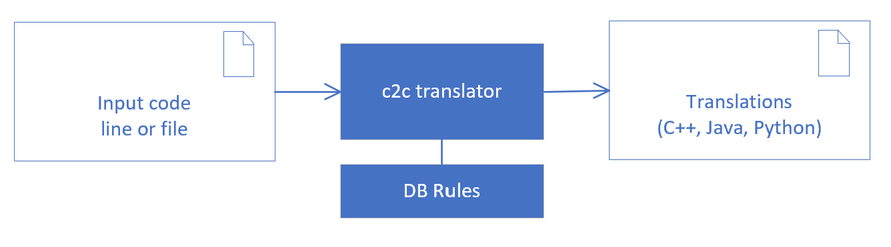
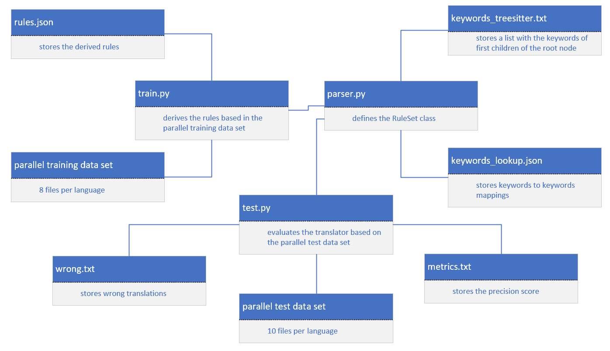
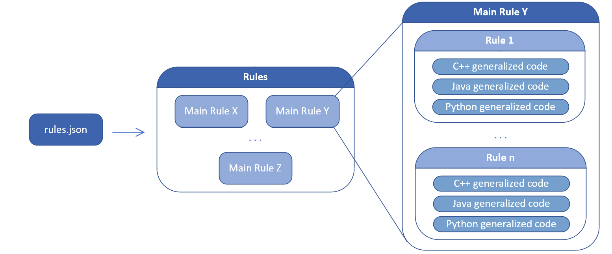
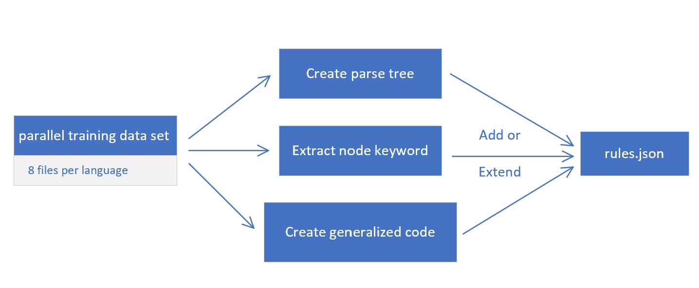
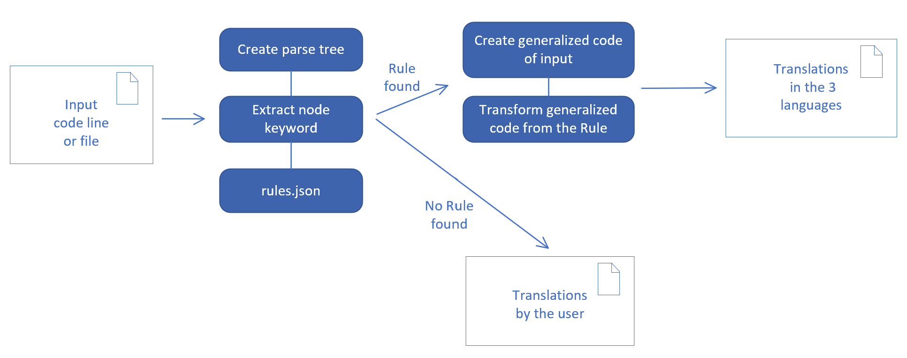

# Follow-Up Developer Documentation

## Current state
Due to a lack of time, it was not possible to automatize the training/ learining procedure, but we focused in the development process on the ability to translate assignments, declarations, for-, while- and if-statements and started with translating entire concepts such as sorting array for example. For a continuation of this project with new members it would be a good start to improve this points.

### Possible future work
1. Automate the derivation of rules, if necessary, so that as little manual work as possible is required.
2. Continue the idea of translating entire concepts
3. Enlarge the parallel training data set

### Where are all necessary functions defined?
* `parser.py` contains the definition of the RuleSet class with all the functions for deriving the rules and translating given line of code or file
* `keywords_lookup.json` contains keyword to keyword mappings used for the translation
* `rules.json` contains the derived rules used then for the translation
* `data/parallel_corpus` contains the parallel training data set used for deriving the rules
* 'concepts.py' contains the definition of Concepts with functions for checking concepts in code and giving suggestions for improvements of translation
* 'concepts.json' contains the concepts that may match with given code and suggest the more efficient way
* 'keywords_concept.txt' contains the keywords to look up entries in concepts.json

### Add new rules
Of course, rules can also be added manually by modifying the rules.json file. But since this is not what we want, to derive rules for concepts other than assignments, declarations, if-, for-, while-statements, small improvements in parser.py might be necessary, especially for creating correct generalized code. However, you should first try to use the c2c translator without any other implementations.

## Results
It was very time consuming and difficult, as we initially thought, to develop a working concept for deriving rules and translating given line code or source files.

### The initial goal
The goal of this project was to create a rule-based code-to-code translator for the programming languages C++, Java and Python. The main idea was to generate and continuously extend a pattern/rule database using parallel corpora. Then the input source code should be split into parts and translated via the database or by the user.

### Useful collected knowledge
* You do not need a lot of training data, one example per concept is sufficient as long as it is parallel (i.e. available in the three programming languages C++, Java and Python).

## Software Architecture
Below you can take a look at the architecture. 

Here the structure of the DB is presented.

The training proceeds as follows.

The translation proceeds as follows:

